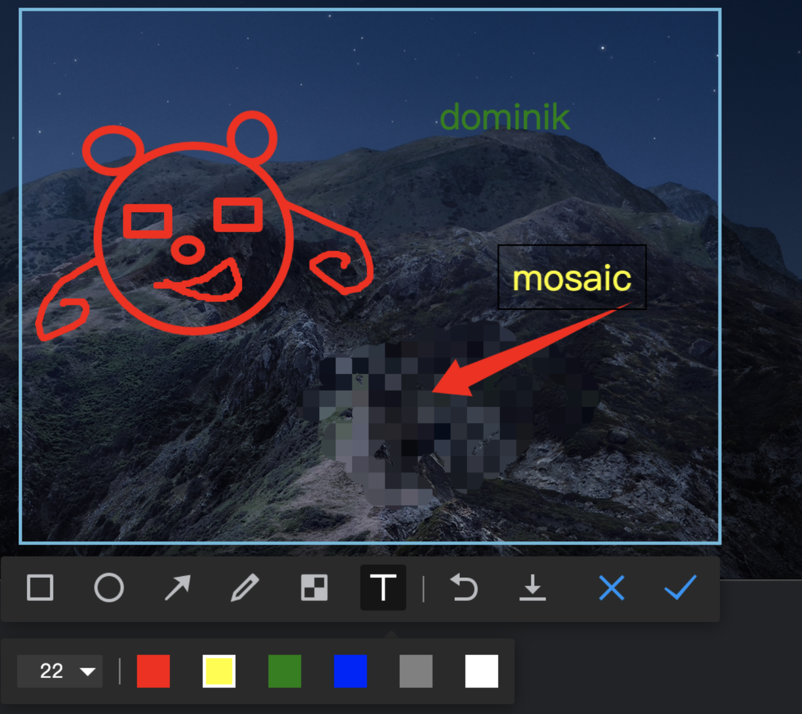

## 安装

`npm install electron-captureview`

## 用法
1. 主进程中初始化截图
```js
import CaptureView from 'electron-captureview'
// ... 跟主窗口一起创建
const capture = new CaptureView({
    devTools: false,
    Mosaic: false,
    Text: false,
    onShow: () => {
      console.log('启动截图')
    },
    onClose: () => {
      console.log('结束截图')
    },
    onShowByShortCut: () => {
      console.log('快捷键启动截图')
    }
  })
// capture.updateShortCutKey('shift+option+c')
// capture.setMultiScreen(false)
```

2.渲染进程中调用截图对象
```js
const { remote } = require('electron')
const captureview = remote.getGlobal('captureView')
captureview.open()
```

#### 已知问题

* ubuntu18的截图在全屏窗口下左边的dock不会被覆盖,导致不能全屏覆盖
* ubuntu18的扩展屏幕截图会将2个屏幕的信息合在一张图上, 扩展屏截图尚不支持
* 无法像qq,微信等,实现应用窗口的选择

## 选项

|       名称       | 类型     | 说明                                                         | 默认值           |
| :--------------: | -------- | ------------------------------------------------------------ | ---------------- |
|   multiScreen    | boolean  | 是否开启多显示屏截图                                         | false            |
|  globalShortCut  | string   | 快捷键                                                       | 'shift+option+A' |
|     devTools     | boolen   | 打开或关闭截图devtools工具                                             | false            |
|    fileprefix    | string   | 保存的图片文件名字前缀, 默认: fileprefix+yyyymmddhhmmss(时间格式) | ''               |
|     onClose      | ()=>void | 关闭截图的回调函数                                           |                  |
|      onShow      | ()=>void | 打开截图的回调函数                                           |                  |
| onShowByShortCut | ()=>void | 快捷键打开截图的回调函数                                     |                  |
|      Mosaic      | boolean  | 打开马赛克功能                                               | false            |
|       Text       | boolean  | 打开文字编辑功能                                             | false            |
|       curve       | boolean  | 打开画笔编辑功能                                             | false            |

## 方法

|       名称        |     说明     |     参数     | 返回值 |
| :---------------: | :----------: | :----------: | :----: |
|    useCapture     |   初始化截图   |      -       |   -    |
|       open       |  打开截图功能 |              |        |
|       close       | 关闭截图功能 |              |        |
| updateShortCutKey |  更新快捷键  |  key:string  |   -    |
|  setMultiScreen   |  设置扩展屏  | flag:boolean |        |

tips: 考虑性能原因, 多显示屏截图需要多开一个启动窗口,容易消耗性能,所以默认单屏幕截屏

## 展示



## 支持

* Mac完美支持多显示器
* 截图存入剪贴板
* 截图保存本地文件
* 画笔
* 画圆
* 画方框
* 画箭头
* 马赛克
* 文字
* 撤销
* 选框大小调整
* 选框移动
* 快捷键打开,Esc退出

## TODO

* PC端的截图待测试
