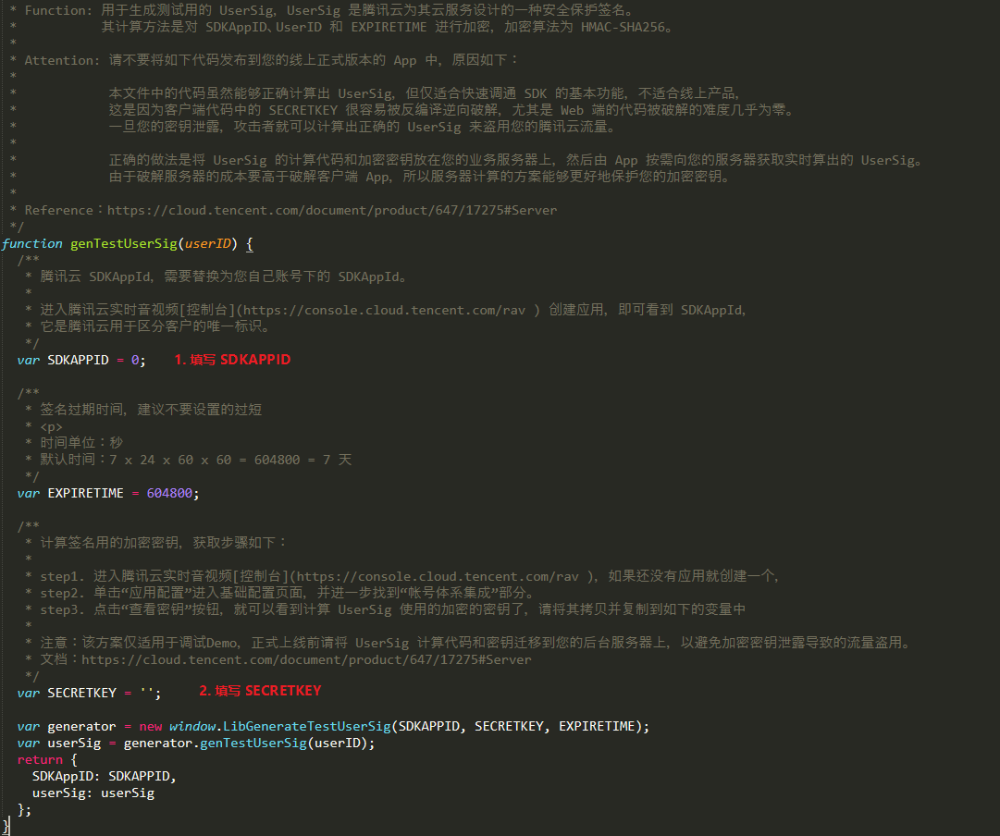

# TIMSDK Web Demo

## 一分钟跑通Demo

1. 下载源码到本地

3. 配置 `SDKAppID` 和 `SECRETKEY`，参考：[密钥获取方法](https://cloud.tencent.com/document/product/269/36838#.E6.AD.A5.E9.AA.A42.EF.BC.9A.E8.8E.B7.E5.8F.96.E5.AF.86.E9.92.A5.E4.BF.A1.E6.81.AF)

   2.1 打开 `/dist/debug/GenerateTestUserSig.js` 文件

   2.2 按图示填写相应配置后，保存文件

   

4. 建议使用 `Chrome` 浏览器打开 `/dist/index.html` 文件，即可预览。

## 开发运行

Web Demo 使用 `Vue` + `Vuex` + `Element-UI` 开发，你可以参考该 Demo 进行业务开发，也可以直接基于本Demo 进行二次开发。 

> 参考文档：
>
> - [TIMSDK 官方文档](https://imsdk-1252463788.file.myqcloud.com/IM_DOC/Web/index.html)

### 目录结构

```
├───sdk/ 
│   ├───tim-js.js - tim sdk 文件，demo 中未使用，仅供自行集成使用
├───dist/  - 打包编译后的目录
├───public/ - 公共入口
│   ├───debug/ - 用于配置SDKAppID 和 SECRETKEY
│   └───index.html
├───src/ - 源码目录
│   ├───assets/ - 静态资源目录
│   ├───components/ - 组件目录
│   ├───store/ - Vuex Store 目录
│   ├───utils/ - 工具函数目录
│   ├───index.vue - 入口文件
│   ├───main.js - Vue 全局配置
│   └───tim.js - TIM SDK相关
├───_doc/ - 文档相关
├───.eslintignore - eslint 忽略配置
├───babel.config.js - babel 配置
├───package.json
├───README.md
└───vue.config.js - vue-cli@3 配置文件
```

### 准备工作

1. 准备好您的 `SDKAPPID` 和 `SECRETKEY`，获取方式参考：[密钥获取方法](https://cloud.tencent.com/document/product/269/36838#.E6.AD.A5.E9.AA.A41.EF.BC.9A.E5.88.9B.E5.BB.BA.E5.BA.94.E7.94.A8)

2. 搭建 [nodejs 环境](https://nodejs.org/zh-cn/) （建议安装 8.0 版本以上的 nodejs），选择官网推荐的安装包，安装即可

   安装完成后，打开命令行，输入以下命令：

   ```shell
   node -v
   ```

   如果上述命令输出相应的版本号，说明环境搭建完成。

### 启动流程

1. 克隆本仓库到本地

   ```shell
   # 命令行执行
   git clone https://github.com/tencentyun/TIMSDK.git
   
   # 进入 Web Demo 项目
   cd TIMSDK/H5
   ```

2. 配置 `SDKAppID` 和 `SECRETKEY`，参考：[密钥获取方法](https://cloud.tencent.com/document/product/269/36838#.E6.AD.A5.E9.AA.A42.EF.BC.9A.E8.8E.B7.E5.8F.96.E5.AF.86.E9.92.A5.E4.BF.A1.E6.81.AF)

   2.1 打开 `/public/debug/GenerateTestUserSig.js` 文件

   2.2 按图示填写相应配置后，保存文件

   

3. 启动项目

   ```shell
   # 同步依赖
   npm install
   # 启动项目
   npm start 
   ```

   > 若同步依赖过程中出现问题，尝试切换 npm 源后重试。
   >
   > ```shell
   > # 切换 cnpm 源
   > npm config set registry http://r.cnpmjs.org/
   > ```

4. 浏览器中打开链接：http://localhost:8080/

### 注意事项

1. 避免在前端进行签名计算

   本 Demo 为了用户体验的便利，将 `userSig` 签发放到前端执行。若直接部署上线，会面临 `SECRETKEY` 泄露的风险。

   正确的 `userSig` 签发方式是将 `userSig` 的计算代码集成到您的服务端，并提供相应接口。在需要 `userSig` 时，发起请求获取动态 `userSig`。更多详情请参见 [服务端生成 UserSig](https://cloud.tencent.com/document/product/269/32688#GeneratingdynamicUserSig)。

### Change Log

#### 2019/09/05

**Bug Fixes**

- 修复预览图片时，图片显示不正确的问题
- 修复点击群组列表时，群成员列表不更新的问题
- 解决修改个人资料时，报错的问题