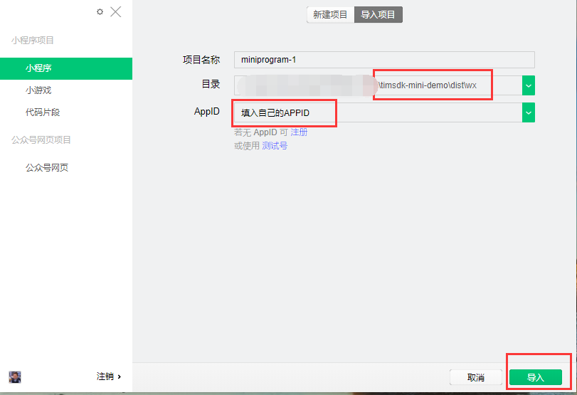
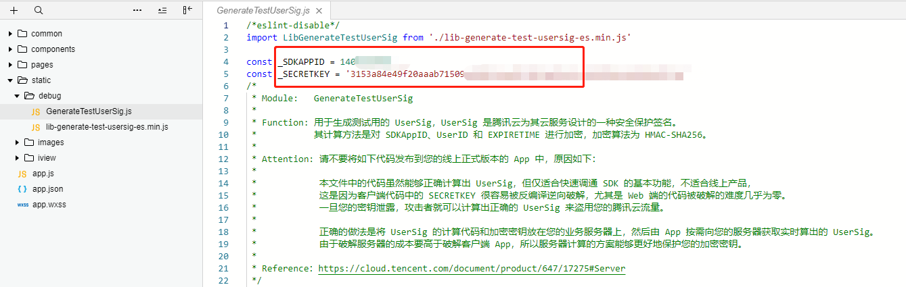
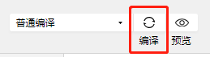
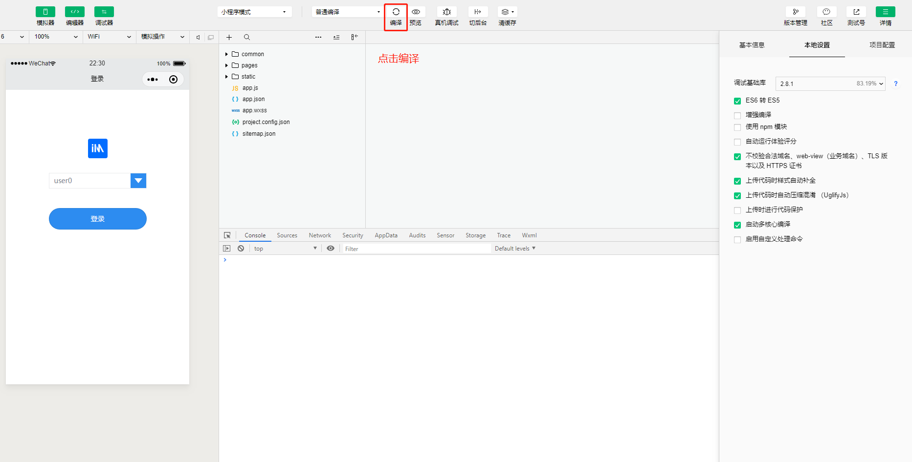
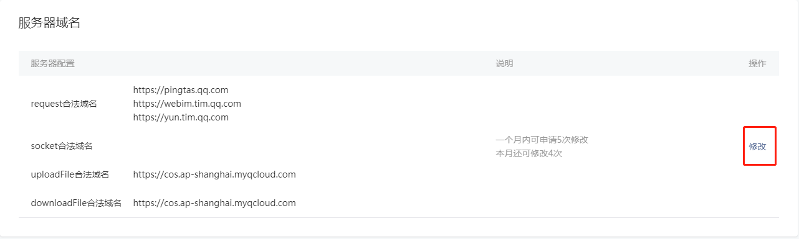
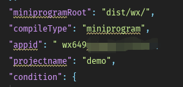
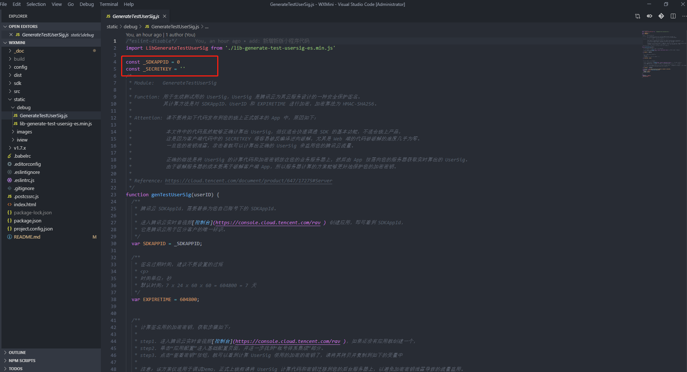
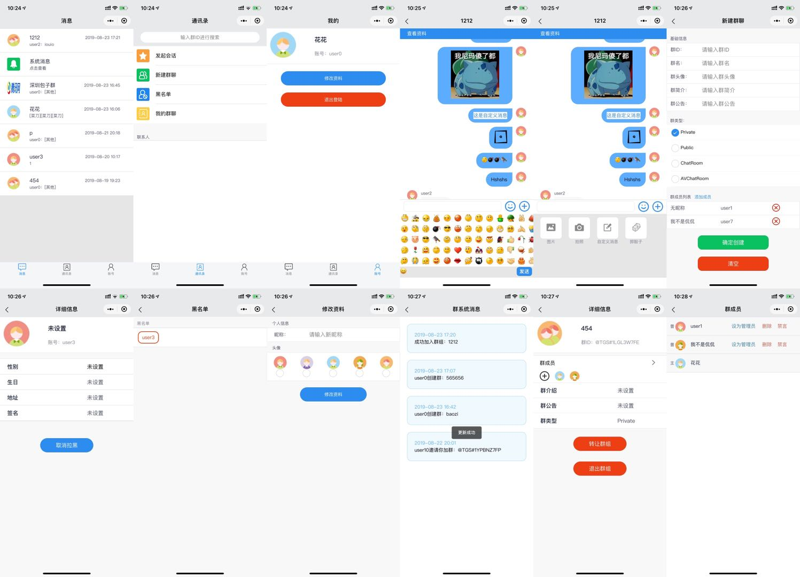

# IMSDK小程序demo运行

本 IM 小程序 demo 是基于 MpVue 框架进行开发的。`一分钟跑通 demo` 小节只是用于引导您打开编译后文件进行快速预览 demo，如果您想要进行二次开发，请看`开发运行`小节。
##  一分钟跑通demo

1. 克隆本仓库到本地

   ```shell
   # 命令行执行
   git clone https://github.com/tencentyun/TIMSDK.git
   
   # 进入 Web Demo 项目
   cd TIMSDK/WXMini
   ```

2. 安装微信小程序 [开发者工具](https://mp.weixin.qq.com/debug/wxadoc/dev/devtools/download.html)。

3. 使用微信开发者工具导入项目，**请注意目录为 `/dist/wx`**，然后填入自己的小程序AppID。

   

4. 配置 `SDKAPPID` 和 `SECRETKEY`，获取方式参考：[密钥获取方法](https://cloud.tencent.com/document/product/269/36838#.E6.AD.A5.E9.AA.A41.EF.BC.9A.E5.88.9B.E5.BB.BA.E5.BA.94.E7.94.A8)
   - 打开 `/debug/GeneraterUserSig.js` 文件

   - 按图示填写相应配置后，保存文件

   

5. 本地配置如图右边选项

   - 勾选ES6转ES5选项
   - 勾选不检验合法域名选项
   - 基础库版本 > 2.1.1

   

6. 点击编译即可运行

   

   > ### 注意事项
   >
   > **合法域名**
   >
   >    请将以下域名在[【微信公众平台】](https://mp.weixin.qq.com/)>【开发】>【开发设置】>【服务器域名】中进行配置
   >
   > 进入微信公众平台，在小程序开发的服务器域名配置相关域名信息
   >
   > 添加到 **request 合法域名**：
   >
   > |            域名            | 说明            | 是否必须 |
   > | :------------------------: | --------------- | -------- |
   > | `https://webim.tim.qq.com` | Web IM 业务域名 | 必须     |
   > |  `https://yun.tim.qq.com`  | Web IM 业务域名 | 必须     |
   > |  `https://pingtas.qq.com`  | Web IM 统计域名 | 必须     |
   >
   > 添加到 **uploadFile 合法域名**：
   >
   > |                  域名                  | 说明         | 是否必须 |
   > | :------------------------------------: | ------------ | -------- |
   > | `https://cos.ap-shanghai.myqcloud.com` | 文件上传域名 | 必须     |
   >
   > 添加到 **downloadFile 合法域名**：
   >
   > |                  域名                  | 说明         | 是否必须 |
   > | :------------------------------------: | ------------ | -------- |
   > | `https://cos.ap-shanghai.myqcloud.com` | 文件下载域名 | 必须     |
   >
   > 

##  开发运行

### 项目目录

```xml
├───sdk/               - demo 中未使用，仅供自行集成 
├  └───wx/ 
├───build/   
├───config/
├───dist/
│   └───wx/            - MpVue 项目编译后文件目录，使用小程序开发工具导入此文件夹
├───src/
│   ├───components/    - 组件
│   ├───pages/         - 页面
│   ├───store/         - Vuex 目录
│   ├───stylus/        - 全局主题色样式，可以修改全局颜色
│   ├───utils/         - 方法
│   ├───app.json
│   ├───App.vue
│   └───main.js
├───static/            - 静态依赖资源
│   ├───debug/         - 包含 userSig 验证登录方法
│   ├───images/        - 图片
│   └───iview/         - 使用的 iview 组件
├───_doc/
├───.babelrc
├───.editorconfig
├───.eslintignore
├───.eslintrc.js
├───.postcssrc.js
├───index.html
├───package-lock.json
├───package.json
├───project.config.json
└───README.md

```

### 准备工作

1. 获取到您应用的 `SDKAPPID` 和 `SECRETKEY`，方式参考：[密钥获取方法](https://cloud.tencent.com/document/product/269/36838#.E6.AD.A5.E9.AA.A41.EF.BC.9A.E5.88.9B.E5.BB.BA.E5.BA.94.E7.94.A8)

2. 安装微信小程序 [开发者工具](https://mp.weixin.qq.com/debug/wxadoc/dev/devtools/download.html)

3. 安装 [nodejs 环境](https://nodejs.org/zh-cn/) ( Version > 8 ) ，选择合适您安装环境的安装包
   
   - 安装后，在命令行输入`node --version` ，如果 > 8 即可

### 启动流程

1. 克隆本仓库到本地
   
     ```shell
     # 命令行执行
     git clone https://github.com/tencentyun/TIMSDK.git
     
     # 进入 Demo 项目
     cd TIMSDK/WXMini
    ```

2. 将`project.config.json`文件中的`appid`修改为自己微信小程序的`appid`

   

3. 配置 `SDKAPPID` 和 `SECRETKEY`，获取方式参考：[密钥获取方法](https://cloud.tencent.com/document/product/269/36838#.E6.AD.A5.E9.AA.A41.EF.BC.9A.E5.88.9B.E5.BB.BA.E5.BA.94.E7.94.A8)
    - 打开 `/static/debug/GeneraterUserSig.js` 文件
    
    - 按图示填写相应配置后，保存文件
    
     
    
4. 安装依赖并启动
   
   ```shell
   # 安装demo构建和运行所需依赖
   npm install
   
   # 构建并生成最终可在小程序开发工具内使用的代码
   npm run start
   ```
   
   > 使用 `npm install` 命令，如果有些依赖包无法成功安装
   >
   > 您可以试着切换源， 例如： `npm config set registry http://r.cnpmjs.org/`
   >
   > 然后再执行 `npm install`
   
5. 使用微信开发者工具导入项目，目录为`/dist/wx`

    

6. 点击开发工具的编译即可预览该项目

   

   > ### 注意事项
   >
   > **合法域名**
   >
   >    请将以下域名在[【微信公众平台】](https://mp.weixin.qq.com/)>【开发】>【开发设置】>【服务器域名】中进行配置
   >
   > 进入微信公众平台，在小程序开发的服务器域名配置相关域名信息
   >
   > 添加到 **request 合法域名**：
   >
   > |            域名            | 说明            | 是否必须 |
   > | :------------------------: | --------------- | -------- |
   > | `https://webim.tim.qq.com` | Web IM 业务域名 | 必须     |
   > |  `https://yun.tim.qq.com`  | Web IM 业务域名 | 必须     |
   > |  `https://pingtas.qq.com`  | Web IM 统计域名 | 必须     |
   >
   > 添加到 **uploadFile 合法域名**：
   >
   > |                  域名                  | 说明         | 是否必须 |
   > | :------------------------------------: | ------------ | -------- |
   > | `https://cos.ap-shanghai.myqcloud.com` | 文件上传域名 | 必须     |
   >
   > 添加到 **downloadFile 合法域名**：
   >
   > |                  域名                  | 说明         | 是否必须 |
   > | :------------------------------------: | ------------ | -------- |
   > | `https://cos.ap-shanghai.myqcloud.com` | 文件下载域名 | 必须     |
   >
   > 

## 项目截图



## 备注

### 页面结构

目录 /src/pages

| 页面  | 简介                                                        |
| :------- | ----------------------------------------------------------- |
| login/   | 登录页                                                       |
| index/   | 首页，对话列表                                                |
| chat/    | 聊天对话页 & 群信息/用户信息                                 |
| contact/ | 通讯录                                                       |
| own/     | 个人信息                                                     |
| create/  | 创建群聊                                                     |
| members/ | 群成员                                                       |
| profile/ | 修改个人信息                                                  |
| groups/ | 群列表                                      |
| groupDetail/ | 群详细页 |
| system/  | 系统通知页                                                   |
| blacklist/  | 黑名单页                                                  |
| detail/  | 个人信息&群信息                                               |
| friend/  | 发起会话                                                     |
| mention/ | @选择页 |


## 注意事项

**1. 避免在前端进行签名计算**

本 Demo 为了用户体验的便利，将 `userSig` 签发放到前端执行。若直接部署上线，会面临 `SECRETKEY` 泄露的风险。正确的 `userSig` 签发方式是将 `userSig` 的计算代码集成到您的服务端，并提供相应接口。在需要 `userSig` 时，发起请求获取动态 `userSig`。更多详情请参见 [服务端生成 UserSig](https://cloud.tencent.com/document/product/269/32688#GeneratingdynamicUserSig)。

