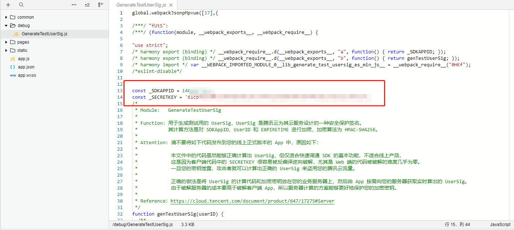
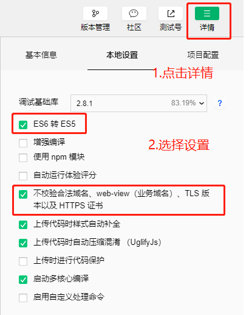
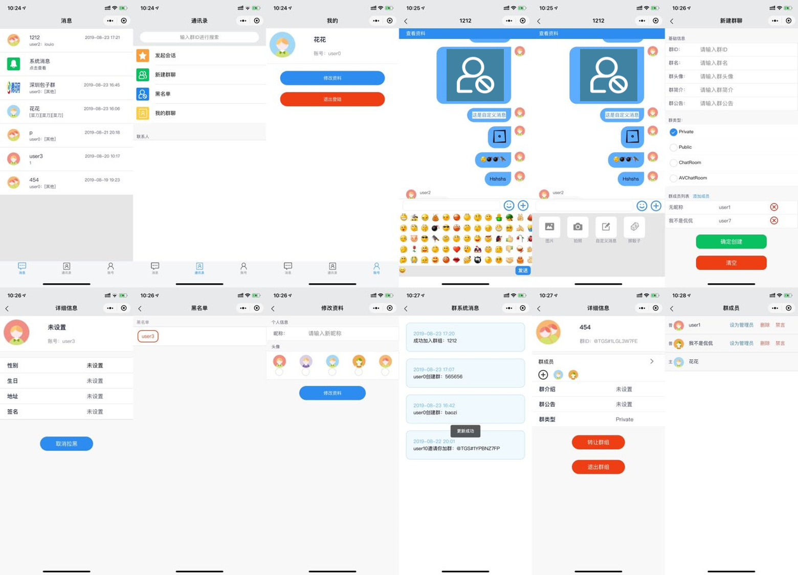

# IMSDK小程序demo运行

[获取 SDKAPPID 和 SECRETKEY](https://cloud.tencent.com/document/product/269/36838#.E6.AD.A5.E9.AA.A41.EF.BC.9A.E5.88.9B.E5.BB.BA.E5.BA.94.E7.94.A8)

##  1分钟预览项目

此小节讲解如何快速在本地预览项目，请按照以下步骤

1. 安装微信小程序 [开发者工具](https://mp.weixin.qq.com/debug/wxadoc/dev/devtools/download.html)。

2. 使用微信开发者工具打开`/dist/wx`目录

   

3. 修改`/dist/wx/static/debug/GeneraterUserSig.js` 文件里的 SDKAPPID 和 SECRETKEY 为第一步获取到的 `SDKAPPID` 和 `SECRETKEY` 

   

4. 点击编译即可运行

   


##  开发运行方法

此小节专为想在本地开发小程序的用户说明如何快速在本地环境跑起来项目

1. 安装微信小程序 [开发者工具](https://mp.weixin.qq.com/debug/wxadoc/dev/devtools/download.html)。

2. 使用 IDE 打开下载后目录

3. 将`project.config.json`文件中的`appid`修改为自己项目使用的

   

4. 将 `/static/debug/GenerateTestUserSig.js`文件里的 `SDKAPPID` 和 `SECRETKEY` 修改为第一步获取到的 `SDKAPPID` 和 `SECRETKEY` 

5. 项目使用了 [MpVue](http://mpvue.com/mpvue/)需要[nodejs](https://nodejs.org/zh-cn/)( Version > 8 ) 环境

   安装依赖并启动

   ```shell
   npm install // 安装demo构建和运行所需依赖
   npm run start / npm run build  // 构建并生成最终可在小程序开发工具内使用的代码
   ```

   > **常见问题：**
   >
   > 1. node 版本希望大于 8
   >
   > 2. npm install 出现问题
   >
   >    有时使用 npm install 命令有些依赖包无法成功安装，你可以试着切换 npm 源，然后再执行npm install命令

6. 会生成有`dist/wx`文件夹

7. 使用微信开发者工具导入项目，目录为`/dist/wx`

  

8. 点击开发工具的编译即可预览该项目

   

   > **常见问题：**
   >
   > 1. 合法域名
   >
   >    进入微信公众平台，在小程序开发的服务器域名配置相关域名信息
   >
   >    
   >
   > 2. 基础库
   >
   >    如果打开项目后，编译报错，请您升级小程序开发工具，基础库使用>2.1.1,
   >
   > 3. 本地配置
   >
   >    本地开发时可以勾选不校验合法域名等

9. 开发参考文档

    > 1. [MpVue](http://mpvue.com/)
    > 2. [Vue](https://cn.vuejs.org/index.html)
    > 3. [Vuex](https://vuex.vuejs.org/zh/guide/)

## 项目截图

   

## 项目目录

```xml
├───build/   
├───config/
├───dist/
│   └───wx/ - MpVue项目编译后文件目录，使用小程序开发工具导入此文件夹
├───src/
│   ├───components/ - 组件
│   ├───pages/ - 页面
│   ├───store/ - Vuex 目录
│   ├───stylus/ - 全局主题色样式，可以修改全局颜色
│   ├───utils/ - 方法
│   ├───app.json
│   ├───App.vue
│   └───main.js
├───static/ - 静态依赖资源
│   ├───debug/ - 包含userSig验证登录方法
│   ├───images/ - 图片
│   └───iview/ - 使用的iview组件
├───_doc/
├───.babelrc
├───.editorconfig
├───.eslintignore
├───.eslintrc.js
├───.postcssrc.js
├───index.html
├───package-lock.json
├───package.json
├───project.config.json
└───README.md

```

#### src/pages

| 页面  | 关于                                                         |
| :------- | ----------------------------------------------------------- |
| login/   | 登录页                                                       |
| index/   | 首页，对话列表                                                |
| chat/    | 聊天对话页 and 群信息/用户信息                                 |
| contact/ | 通讯录                                                       |
| own/     | 个人信息                                                     |
| create/  | 创建群聊                                                     |
| members/ | 群成员                                                       |
| profile/ | 修改个人信息                                                  |
| groups/ | 群列表                                      |
| groupDetail/ | 群详细页 |
| system/  | 系统通知页                                                   |
| blacklist/  | 黑名单页                                                  |
| detail/  | 个人信息&群信息                                               |
| friend/  | 发起会话                                                     |
| mention/ | @选择页 |
